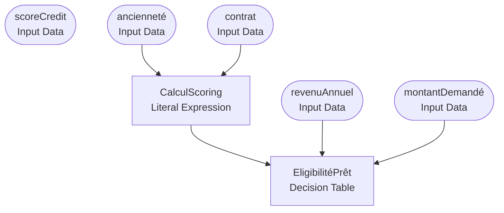

# Decision  — Loan Approval

> Auto generated by `dmn2md` at 2026-04-22T18:16:25+02:00

- **Namespace** : http://example.com/loan

## Decision Requirements Diagram



---

## Décisions

### `CalculScoring`

- **Type** : Literal Expression
- **outputs** : `scoreAjusté` (`number`)
- **inputs** : `anciennete`, `contrat`

#### Expression

```feel
if ancienneté >= 5 and contrat = "CDI"
then scoreBase + 50
else if contrat = "CDD"
then scoreBase - 20
else scoreBase
```

### `EligibilitéPrêt`

- **Type** : Decision Table
- **outputs** : `décision` (`string`)
- **inputs** : `revenuAnnuel`, `montantDemande`
- **dependecnies** : `CalculScoring`

#### Table

- **Hit Policy** : `FIRST`

| # | Score ajusté<br/>`scoreAjusté` | Revenu annuel (€)<br/>`revenuAnnuel` | Montant demandé (€)<br/>`montantDemandé` | Décision | Taux d'intérêt | Description |
| --- | --- | --- | --- | --- | --- | --- |
| 1 | >= 750 | >= 40000 | <= 200000 | "APPROUVÉ" | 0.025 | Score élevé, bon revenu, petit montant |
| 2 | [600..750) | >= 30000 | <= 100000 | "APPROUVÉ" | 0.04 | Score moyen, revenu suffisant, montant modéré |
| 3 | [600..750) | >= 30000 | > 100000 | "EN_RÉVISION" | null | Score moyen, revenu suffisant, montant élevé → révision |
| 4 | < 600 | - | - | "REFUSÉ" | null | Score faible → refus automatique |

> **Allowed values**
> - `Score ajusté` : `[300..850]`
> - `Décision` : `"APPROUVÉ","EN_RÉVISION","REFUSÉ"`

## Data dictionnary

| Nom | Type | Role | Allowed values |
| --- | --- | --- | --- |
| `Décision` | `string` | Sortie | "APPROUVÉ","EN_RÉVISION","REFUSÉ" |
| `Taux d'intérêt` | `number` | Sortie | — |
| `ancienneté` | `?` | Input Data | — |
| `contrat` | `?` | Input Data | — |
| `décision` | `string` | Sortie | — |
| `montantDemandé` | `number` | Entrée | — |
| `revenuAnnuel` | `number` | Entrée | — |
| `scoreAjusté` | `number` | Sortie | — |
| `scoreCredit` | `?` | Input Data | — |

