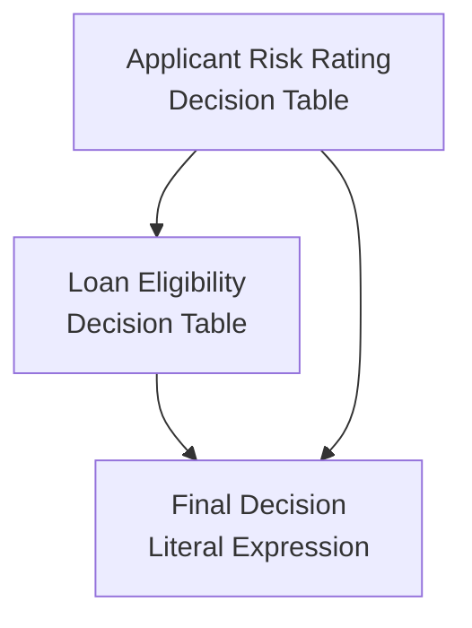

# dmn2md

Convert DMN decision tables to structured Markdown, ready to use as Claude Code skills.


 <!-- TODO: wire up CI badge -->


## Overview

`dmn2md` reads DMN (Decision Model and Notation) XML files and produces structured Markdown
documents that describe decisions, their dependencies, and a data dictionary.
The output is designed to be dropped into Claude Code as a skill or context file, giving the
model an accurate, readable representation of your business rules without requiring it to parse
raw XML.

It targets business analysts who want readable documentation from their DMN models and
developers who want to feed decision logic into AI-assisted workflows.

## Installation

### Prerequisites

- Go 1.26.2 or later

### From source

```bash
git clone https://github.com/jppop/dmn2md.git
cd dmn2md
go build -o dmn2md cmd/dmn2md/main.go
```

### Quick install

```bash
go install github.com/jppop/dmn2md@latest
```

## Usage

### Basic syntax

```bash
dmn2md <file.dmn>
```

Output is written to stdout.

### Flags

<!-- TODO: no flags are currently implemented; document --format and --output once added -->

No flags are defined yet. The only argument is the path to the DMN file.

### Examples

**Example 1 — Basic conversion**

Input snippet (`eligibilite.dmn`):

```xml
<definitions xmlns="https://www.omg.org/spec/DMN/20191111/MODEL/"
             name="Eligibilite" namespace="http://example.com/eligibilite">
  <decision id="eligibilite" name="Eligibilité">
    <decisionTable id="dt_1" hitPolicy="FIRST">
      <input id="i_age" label="Âge">
        <inputExpression typeRef="integer"><text>age</text></inputExpression>
      </input>
      <input id="i_statut" label="Statut">
        <inputExpression typeRef="string"><text>statut</text></inputExpression>
      </input>
      <output id="o_1" label="Résultat" typeRef="string"/>
      <!-- rules … -->
    </decisionTable>
  </decision>
</definitions>
```

Command:

```bash
dmn2md eligibilite.dmn
```

Resulting decision table (excerpt):

```markdown
### `Eligibilité`

- **Type** : Decision Table
- **outputs** : `Résultat` (`string`)
- **inputs** : `age`, `statut`

#### Table

- **Hit Policy** : `FIRST`

| # | Âge<br/>`age` | Statut<br/>`statut` | Résultat<br/>`Résultat` |
| --- | --- | --- | --- |
| 1 | < 18 | * | "Refusé" |
| 2 | >= 18 | "actif" | "Accepté" |
| 3 | >= 18 | * | "En attente" |
```

(`-` entries in the DMN are rendered as `*`.)

**Example 2 — Skill format**

<!-- TODO: --format flag not yet implemented (skill.go not yet written) -->

```bash
# dmn2md --format skill eligibilite.dmn
```

> Not yet implemented.

**Example 3 — Write to file**

<!-- TODO: --output flag not yet implemented -->

```bash
# dmn2md --output spec.md loan-approval.dmn
```

> Not yet implemented. Redirect stdout in the meantime:
>
> ```bash
> dmn2md loan-approval.dmn > spec.md
> ```

**Example 4 — Use with Claude Code**

Place the generated Markdown file in your `.claude/` directory or reference it from `CLAUDE.md`
with `@path/to/spec.md`. Claude Code loads it as context, giving the model a precise description
of your decision rules. You can then ask Claude to apply the rules, explain them, or generate
test cases directly from the spec.

## Output format

Each generated document contains three sections.

### Decision Requirements Diagram

A Mermaid `flowchart TD` showing all decisions and their dependencies.
Decision nodes use `[name]` shape; input data nodes use `([name])` shape.

```markdown
## Decision Requirements Diagram


```

### Decisions

One subsection per decision, rendered in topological order (dependencies before dependents).

- **Decision Table** — hit policy, Markdown table with inputs and outputs, `*` for any-value entries.
- **Literal Expression** — FEEL expression in a fenced `feel` code block.

### Data dictionary

A flat, alphabetically sorted table of every input and output variable across all decisions,
with name, type, and role.

See [`testdata/expected/loan-approval.md`](testdata/expected/loan-approval.md) for a complete example.

## DMN support

| Element | Supported | Notes |
| --- | --- | --- |
| `<definitions>` | ✅ | `name` and `namespace` attributes |
| `<decision>` | ✅ | `id` and `name` attributes |
| `<decisionTable>` | ✅ | `hitPolicy` stored as-is; `FIRST` and `UNIQUE` tested |
| `<input>` / `<inputExpression>` | ✅ | `label`, `typeRef`, expression text |
| `<output>` | ✅ | `label`, `name` (FEEL variable), `typeRef` |
| `<rule>` / `<inputEntry>` / `<outputEntry>` | ✅ | `description` parsed; `-` entries rendered as `*` |
| `<literalExpression>` | ✅ | FEEL expression text in fenced code block |
| `<variable>` | ✅ | Output name and type for literal expressions |
| `<informationRequirement>` | ✅ | Decision-to-decision dependencies and DRD arrows |
| `<inputData>` | ❌ | Not parsed; input data nodes absent from generated DRD |
| `<knowledgeRequirement>` | ❌ | Not parsed |
| `<allowedValues>` | ❌ | Not parsed |

## Contributing

```bash
# Run all tests
go test ./...

# Run linter
golangci-lint run

# Format code
gofumpt -w .
```

Commits must follow [Conventional Commits](https://www.conventionalcommits.org/):
`feat:`, `fix:`, `test:`, `docs:`, `refactor:`.

## License

<!-- TODO: add LICENSE file -->

MIT
