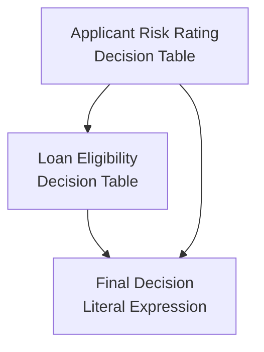

# dmn2md

Convert DMN decision tables to structured Markdown — for human documentation, Claude Code slash commands, or Claude behavioral rules.


## Overview

`dmn2md` reads DMN (Decision Model and Notation) XML files and produces Markdown in one of three formats, selected with `--mode`:

| Mode | Output | Intended use |
| --- | --- | --- |
| `doc` _(default)_ | Human-readable specification with Mermaid DRD, decision tables, and data dictionary | Documentation, code review, onboarding |
| `skill` | Claude Code slash-command file with YAML frontmatter, required-inputs table, and step-by-step evaluation guide | Drop into `.claude/commands/` — invoke with `/<name>` to evaluate decisions interactively |
| `rule` | Compact imperative rule file with bullet-point conditions and evaluation constraints | Drop into `.claude/rules/` — Claude applies the rules automatically without being invoked |

It targets business analysts who want readable documentation from their DMN models and
developers who want to feed decision logic into AI-assisted workflows.

## Installation

### Prerequisites

- Go 1.26.2 or later

### From source

```bash
git clone https://github.com/jppop/dmn2md.git
cd dmn2md
go build -o dmn2md cmd/dmn2md/main.go
```

### Quick install

```bash
go install github.com/jppop/dmn2md/cmd/dmn2md@latest
```

## Usage

### Basic syntax

```bash
dmn2md [--mode <mode>] <file.dmn>
```

Output is written to stdout. Redirect to a file as needed.

### Flags

| Flag | Short | Default | Description |
| --- | --- | --- | --- |
| `--mode` | `-m` | `doc` | Output format: `doc`, `skill`, or `rule` |

### Examples

**Generate human-readable documentation (default)**

```bash
dmn2md loan-approval.dmn > docs/loan-approval.md
```

**Generate a Claude Code slash command**

```bash
dmn2md --mode skill loan-approval.dmn > .claude/commands/loan-approval.md
# Then invoke it inside Claude Code with: /loan-approval
```

See [`examples/skill-from-dmn.md`](examples/skill-from-dmn.md) for a full walkthrough.

**Generate a Claude behavioral rule**

```bash
dmn2md --mode rule loan-approval.dmn > .claude/rules/loan-approval.md
# Claude now applies these rules automatically whenever the topic arises
```

See [`examples/rule-from-dmn.md`](examples/rule-from-dmn.md) for a full walkthrough.

**Write to a file (general pattern)**

```bash
dmn2md -m doc loan-approval.dmn > spec.md
```

## Output formats

### `doc` — Human-readable specification

Produces a full Markdown document with three sections:

**Decision Requirements Diagram** — a Mermaid `flowchart TD` showing all decisions and their
dependencies. Decision nodes use `[name]` shape; literal-expression nodes are also `[name]`.



**Decisions** — one subsection per decision in topological order (dependencies first).
Decision tables render as Markdown tables with hit policy; literal expressions render as
fenced `feel` code blocks. `-` entries in the DMN are rendered as `*`.

**Data dictionary** — alphabetically sorted table of every input and output variable
across all decisions, with name, type, and role.

See [`testdata/expected/loan-approval.md`](testdata/expected/loan-approval.md) for a complete example.

---

### `skill` — Claude Code slash command

Produces a `.md` file suitable for `.claude/commands/`. Structure:

- **YAML frontmatter** with a `description` field
- **Required inputs** table — only the external inputs the user must supply (intermediate
  outputs produced by earlier decisions are excluded)
- **Evaluation steps** — one section per decision in topological order, each annotated with
  its hit policy; decision tables show a `→ output` column; literal expressions show a FEEL
  block
- **Response format** — instructions telling Claude what to include in its reply

```markdown
---
description: Evaluate Loan Approval given input values
---

# Loan Approval

## Required inputs

| Variable | Type | Description |
| --- | --- | --- |
| `age` | `integer` | Age |
...

## Evaluation steps

### Step 1 — Applicant Risk Rating  _(Hit policy: FIRST — stop at first match)_

| # | `age` | `employmentStatus` | `creditScore` | → `riskRating` |
| --- | --- | --- | --- | --- |
| 1 | < 18 | * | * | "high" |
...
```

See [`testdata/expected/loan-approval-skill.md`](testdata/expected/loan-approval-skill.md) for a complete example.

---

### `rule` — Claude behavioral rule

Produces a compact Markdown file suitable for `.claude/rules/`. Structure:

- **One section per decision** — imperative bullet list of conditions (`input cond → output = value`)
  with the rule description appended as italic text; the intro sentence reflects the hit policy
  (e.g. "Apply the first matching rule" for FIRST, "Exactly one rule must match" for UNIQUE)
- **Literal expressions** rendered as FEEL code blocks with a _Requires_ annotation
- **Constraints** section — evaluation order and a reminder to cite matched rules

```markdown
# Loan Approval

Apply these rules whenever evaluating a Loan Approval.

## Applicant Risk Rating

Determines `riskRating`. Apply the first matching rule:

- `age` < 18 → `riskRating` = "high" _Minor applicant — always high risk_
- `age` >= 18, `employmentStatus` "employed","self-employed", `creditScore` >= 750 → `riskRating` = "low"
...

## Constraints

- Always evaluate decisions in this order: `Applicant Risk Rating` → `Loan Eligibility` → `Final Decision`.
- Always state which rule determined each intermediate value.
```

See [`testdata/expected/loan-approval-rule.md`](testdata/expected/loan-approval-rule.md) for a complete example.

## DMN support

| Element | Supported | Notes |
| --- | --- | --- |
| `<definitions>` | ✅ | `name` and `namespace` attributes |
| `<decision>` | ✅ | `id` and `name` attributes |
| `<decisionTable>` | ✅ | `hitPolicy` stored as-is; `FIRST` and `UNIQUE` tested |
| `<input>` / `<inputExpression>` | ✅ | `label`, `typeRef`, expression text |
| `<output>` | ✅ | `label`, `name` (FEEL variable), `typeRef` |
| `<rule>` / `<inputEntry>` / `<outputEntry>` | ✅ | `description` parsed; `-` entries rendered as `*` |
| `<literalExpression>` | ✅ | FEEL expression text in fenced code block |
| `<variable>` | ✅ | Output name and type for literal expressions |
| `<informationRequirement>` | ✅ | Decision-to-decision dependencies and DRD arrows |
| `<inputData>` | ❌ | Not parsed; input data nodes absent from generated DRD |
| `<knowledgeRequirement>` | ❌ | Not parsed |
| `<allowedValues>` | ❌ | Not parsed |

## Contributing

```bash
# Run all tests
go test ./...

# Run linter
golangci-lint run

# Format code
gofumpt -w .
```

Commits must follow [Conventional Commits](https://www.conventionalcommits.org/):
`feat:`, `fix:`, `test:`, `docs:`, `refactor:`.

## License

MIT
