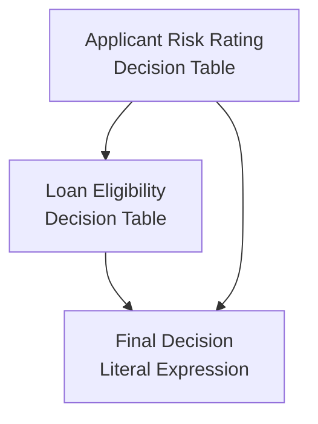

# DMN Specification — Loan Approval

> Generated by `dmn2md`

- **Namespace** : http://example.com/loan-approval

---

## Decision Requirements Diagram



---

## Decisions

### `Applicant Risk Rating`

- **Type** : Decision Table
- **outputs** : `riskRating` (`string`)
- **inputs** : `age`, `employmentStatus`, `creditScore`

#### Table

- **Hit Policy** : `FIRST`

| # | Age<br/>`age` | Employment Status<br/>`employmentStatus` | Credit Score<br/>`creditScore` | Risk Rating<br/>`riskRating` |
| --- | --- | --- | --- | --- |
| 1 | < 18 | * | * | "high" |
| 2 | >= 18 | "employed","self-employed" | >= 750 | "low" |
| 3 | >= 18 | "employed","self-employed" | [600..750) | "medium" |
| 4 | >= 18 | * | * | "high" |

### `Loan Eligibility`

- **Type** : Decision Table
- **outputs** : `isEligible` (`boolean`)
- **inputs** : `riskRating`, `loanAmount`, `loanDuration`
- **dependencies** : `Applicant Risk Rating`

#### Table

- **Hit Policy** : `UNIQUE`

| # | Risk Rating<br/>`riskRating` | Loan Amount<br/>`loanAmount` | Loan Duration (months)<br/>`loanDuration` | Is Eligible<br/>`isEligible` |
| --- | --- | --- | --- | --- |
| 1 | "high" | * | * | false |
| 2 | "low" | <= 100000 | <= 240 | true |
| 3 | "medium" | <= 50000 | <= 120 | true |
| 4 | * | * | * | false |

### `Final Decision`

- **Type** : Literal Expression
- **outputs** : `finalDecision` (`string`)
- **dependencies** : `Loan Eligibility`, `Applicant Risk Rating`

#### Expression

```feel
if isEligible and riskRating = "low" then "approved"
else if isEligible and riskRating = "medium" then "approved with conditions"
else "rejected"
```

## Data dictionary

| Name | Type | Role | Allowed values |
| --- | --- | --- | --- |
| `age` | `integer` | Input | — |
| `creditScore` | `integer` | Input | — |
| `employmentStatus` | `string` | Input | — |
| `finalDecision` | `string` | Output | — |
| `isEligible` | `boolean` | Output | — |
| `loanAmount` | `integer` | Input | — |
| `loanDuration` | `integer` | Input | — |
| `riskRating` | `string` | Output | — |
