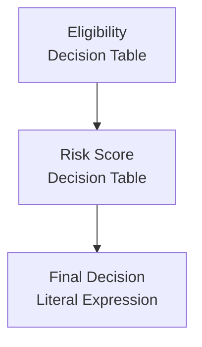

# DMN Specification — Loan Approval

> Generated by `dmn2md`

- **Namespace** : http://example.com/loan

---

## Decision Requirements Diagram



---

## Decisions

### `Eligibility`

- **Type** : Decision Table
- **outputs** : `Is Eligible` (`boolean`)
- **inputs** : `age`, `employmentStatus`

#### Table

- **Hit Policy** : `FIRST`

| # | Age<br/>`age` | Employment Status<br/>`employmentStatus` | Is Eligible |
| --- | --- | --- | --- |
| 1 | < 18 | * | false |
| 2 | >= 18 | "employed","self-employed" | true |
| 3 | >= 18 | * | false |

### `Risk Score`

- **Type** : Decision Table
- **outputs** : `Risk Level` (`string`)
- **inputs** : `isEligible`, `loanAmount`
- **dependencies** : `Eligibility`

#### Table

- **Hit Policy** : `UNIQUE`

| # | Is Eligible<br/>`isEligible` | Loan Amount<br/>`loanAmount` | Risk Level |
| --- | --- | --- | --- |
| 1 | false | * | "high" |
| 2 | true | <= 10000 | "low" |
| 3 | true | > 10000 | "medium" |

### `Final Decision`

- **Type** : Literal Expression
- **dependencies** : `Risk Score`

#### Expression

```feel
if riskLevel = "low" then "approved" else if riskLevel = "medium" then "manual review" else "rejected"
```

## Data dictionary

| Name | Type | Role | Allowed values |
| --- | --- | --- | --- |
| `Is Eligible` | `boolean` | Output | — |
| `Risk Level` | `string` | Output | — |
| `age` | `integer` | Input | — |
| `employmentStatus` | `string` | Input | — |
| `isEligible` | `boolean` | Input | — |
| `loanAmount` | `integer` | Input | — |
